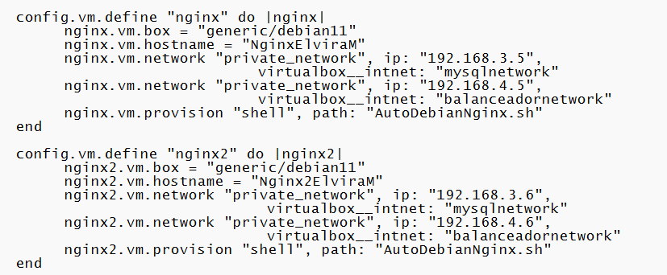
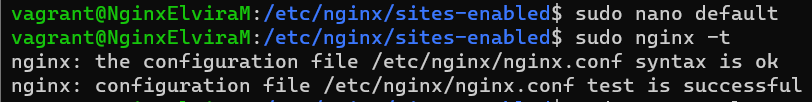

 # BALANCEADOR DE CARGA EN NGINX CON INSTALACIÓN DE UN CMS
 ## ÍNDICE
1. OBJETIVOS DE LA PRÁCTICA
    - ¿QUÉ ES UN BALANCEADOR DE CARGA?
    - ¿QUÉ ES UN CMS?
2. CONFIGURACIÓN VAGRANT
    - CONFIGURACIÓN DE RED MÁQUINAS VIRTUALES
    - APROVISIONAMIENTO VAGRANTFILE
3. CONFIGURACIÓN MYSQLELVIRAM
4. CONFIGURACIÓN NFSELVIRAM
    - ¿QUÉ ES UN SISTEMA DE ARCHIVOS NFS?
    - CONFIGURACIÓN SERVIDOR NFS
    - CONFIGURACIÓN DEL SERVIDOR NFS PARA COMUNICARSE A TRAVÉS DE UN SOCKET TCP/IP CUANDO NGINX Y PHP-FPM SE EJECUTA EN MÁQUINAS DIFERENTES
    - CONFIGURACIÓN CMS (MOODLE)
5. CONFIGURACIÓN NGINXELVIRAM Y NGINX2ELVIRAM
    - CREACIÓN Y MONTAJE DE LOS DIRECTORIOS EN EL CLIENTE (NFS)
    - CONFIGURACIÓN CMS (MOODLE)
6. CONFIGURACIÓN BALANCEADORELVIRAM
    - CONFIGURACIÓN BALANCEADOR HTTP
    - CONFIGURACIÓN BALANCEADOR HTTPS (SSL)

---   
# OBJETIVOS DE LA PRÁCTICA
 En esta práctica deberemos automatizar la instalación y configuración de una aplicación web LEMP en cuatro máquinas virtuales con un CMS, en este caso Moodle. El objetivo de esta práctica es crear una arquitectura de alta disponibilidad que sea escalable y redundante, de modo que podamos balancear la carga entre todos los frontales web.
 
 ### - **¿QUÉ ES UN BALANCEADOR DE CARGA?**
---
 Un balanceador de carga es un dispositivo hardware o software que se pone al frente de un conjunto de servidores y se encarga de asignar o balancear las peticiones que llegan de los clientes hacia los servidores

 ### - **¿QUÉ ES UN CMS?**
---
 Un CMS es un sistema de gestión de contenido (CMS en sus siglas en inglés: Content Management System) es una aplicación de software que se ejecuta en un navegador. Proporciona a los usuarios una interfaz gráfica de usuario que les permite crear y administrar un sitio web sin necesidad de codificarlo desde cero.

---
# CONFIGURACIÓN VAGRANT
Antes de comenzar, crearemos una carpeta en nuestro ProyectoVagrant para desplegar nuestras máquinas virtuales con el archivo "vagrantfile". Para ello creamos la carpeta que llamaremos BalanceadorDeCargaNginx con el siguiente comando: 

    mkdir LempTresNivelesCMS

Para crear el archivo "vagrantfile" con su correspondiente configuración, lo primero que haremos será entrar en nuestra carpeta, en la cual levantaremos las cuatro máquinas y utilizando el siguiente comando:

    vagrant init

Nos aparecerá en el terminal el siguiente mensaje, como que se ha creado correctamente el archivo "vagrantfile"

 ### - **CONFIGURACIÓN DE RED MÁQUINAS VIRTUALES**
---
Modificaremos nuestro archivo **"vagrantfile"** para levantar nuestras cinco máquinas virtuales generic/debian. Para ello hay que tener en cuenta las siguientes características:

1. Deberemos tener una máquina, la cual llamaremos **MysqlELviraM**, esta tendrá una red privada, que esté conectada a la misma red de las máquinas **NginxElviraM**, **Nginx2ElviraM** y **NfsElviraM**, además de una red pública (sola mente para descargar los archivos de configuración, después deberemos quitarla).

    

2. Para la segunda máquina y tercera máquina, la cual llamaremos **NginxElviraM** y **Nginx2ElviraM**, estas tendrán dos redes privadas, una en la misma red de la máquina **MysqlEviraM** y otra en la misma red de **BalanceadorElviraM**, además de una red pública (sola mente para descargar los archivos de configuración, después deberemos quitarla).

    

3. Para la tercera máquina, la cual llamaremos **NfsElviraM**, tendrá dos redes privadas una en la misma red de la máquina **MysqlEviraM** y otra en la misma red de **BalanceadorElviraM**, además de una red pública (sola mente para descargar los archivos de configuración, después deberemos quitarla).

    

4. Para la última máquina, la cual llamaremos **BalanceadorElviraM**, deberá estar en la misma red de las tres máquinas mencionadas anteriormente, **NginxElvira** **Nginx2ElviraM** y **NfsElviraM**, además de tener una red pública. 

    

  ### - **APROVISIONAMIENTO VAGRANTFILE**
--- 
A partir de este momento, con la configuración de red creada en nuestras máquinas virtuales, en el vagrantfile, crearemos varios scripts de aprovisionamiento para automatizar descargas :

1. Descargar automáticamente Servidor MySQL (MysqlElviraM).

    
   
2. Descargar automáticamente los servidores Nginx, MySQL Cliente y Nfs Cliente(NginxElviraM) y (Nginx2ElviraM).

    

3. Descargar automáticamente los servidores Nfs y Php con todos sus módulos (NfsElviraM)

    

4. Descargar automáticamente los servidores Nginx (BalanceadorElviraM)

    

---
# CONFIGURACIÓN MYSQLELVIRAM
En este momento, comenzaremos a configurar la máquina **elviramysql**, conectándonos por ssh a la máquina con el comando:

    vagrant ssh elviramysql

En primer lugar, daremos de alta a un nuevo usuario, y le asignaremos algunos privilegios. En este caso utilizaremos el usuario **root**, pero antes deberemos de asignarle una contraseña.

    sudo mysql_secure_installation

 

Una vez cambiado la contraseña al root, crearemos un usuario llamado **moodle_user** con su contraseña **moodle_password**, además de darle unos privilegios, pero solo para esta base de datos **Moodle_CMS**, para ello utilizaremos los siguientes comandos:

    mysql -u root -p
    create user 'moodle_user'@'%'identified by 'moodle_password';
    grant all privileges on Moodle_CMS.* to 'moodle_user'@'%';
    flush privileges;

Para verificar que hemos creado bien el usuario nuevo, nos dirigiremos a la base de datos **mysql** y mostraremos las tablas **user** , **host** y **plugin**.

---
# CONFIGURACIÓN NFSELVIRAM

### - **¿QUÉ ES UN SISTEMA DE ARCHIVOS NFS?**
---
El sistema de archivos de red (Network File System, NFS) es una aplicación cliente/servidor que permite a un usuario de equipo ver y, opcionalmente, almacenar y actualizar archivos en un equipo remoto como si estuvieran en el propio equipo del usuario. El protocolo NFS es uno de varios estándares de sistema de archivos distribuidos para almacenamiento atado a la red (NAS).

### - **CONFIGURACIÓN SERVIDOR NFS**
---
En primer lugar crearemos el montaje NFS, para almacenar la configuración de nuestro CMS además de cambiarle la propiedad de usuario y grupo del directorio. 

    sudo mkdir /var/www/MoodleCMS -p
    sudo chown nobody:nogroup /var/www/MoodleCMS

Una vez realizados los cambios deberemos abrir el archivo **/etc/exports** y crearemos una línea para cada uno de los directorios que vamos a compartir, en este caso serían dos **(NginxElviraM)** y **(Nginx2ElviraM)**.

    sudo nano /etc/exports

  - **rw**: permisos que asignamos al cliente (lectura y escritura).

  - **sysnc**:  escribe los cambios en el disco antes de responder.

  - **no_subtree_check**: evita la verificación de subárbol.

Cuando termines de hacer los cambuos deberemos reiniciar el servidor NFS con el siguiente comando:

    sudo systemctl restart nfs-kernel-server

### - **CONFIGURACIÓN DEL SERVIDOR NFS PARA COMUNICARSE A TRAVÉS DE UN SOCKET TCP/IP CUANDO NGINX Y PHP-FPM SE EJECUTA EN MÁQUINAS DIFERENTES**
---
En primer lugar, tenemos que modificar el archivo **www.conf** que se encuentra en la ruta **/etc/php/7.4/fpm/pool.d/www.conf**.

    sudo nano /etc/php/7.4/fpm/pool.d/www.conf

Una vez dentro del archivo observamos la línea que debemos cambiar **listen** se encuentra por defecto escuchando en el socket UNIX y deberemos modificarlo por la dirección **0.0.0.0** y un puerto, en este caso utilizaremos el puerto **9000**.

Cuando terminemos de realizar las modificaciones, deberemos reiniciar el servicio de php-fpm.

    sudo systemctl restart php7.4-fpm

Para comprobar que se han realizado los cambios y que php-fpm escucha en la dirección **0.0.0.0:9000**, utilizaremos el siguiente comando:

    sudo netstat -tulpn

### - **CONFIGURACIÓN CMS (MOODLE)**
---
En este caso utilizaremos el CMS, Moodle. Al trabajar de forma remota, utilizaremos la herramienta wget con la que podremos descargar el paquete .tgz.

    cd /var/www/MoodlCMS
    sudo wget https://download.moodle.org/download.php/direct/stable400/moodle-latest-400.tgz

Una vez descargado, deberemos descomprimir el archivo que acabamos de descargar y moveremos todos los archivos descomprimidos a /var/www/MoodleCMS.

    sudo tar -xzvf moodle-latest-400.tgz -C
    sudo mv * /var/www/MoodleCMS
    
Tras realizar estas configuraciones, pasaremos a editar el archivo **php.ini**, modificando la línea **max_input_vars** de 1000 a 5000.

    cd /etc/php/7.4/fpm
    sudo nano php.ini

---
# CONFIGURACIÓN NGINXELVIRAM Y NGINX2ELVIRAM

### - **CREACIÓN Y MONTAJE DE LOS DIRECTORIOS EN EL CLIENTE (NFS)**
---
Una vez configurado **MysqlElviraM**, pasaremos a configurar **NginxElvira** y **Nginx2ElviraM**. 

Lo primero que deberemos hacer es crear será una carpeta llamada **MoodleCMS** y configurar sus permisos en /var/www además de montar la carpeta creada en nuestro servidor nfs.

    sudo mkdir /var/www/MoodleCMS -p
    sudo chown -R www-data.www-data MoodleCMs
    sudo mount 192.168.4.7:/var/www/MoodleCMs /var/www/MoodleCMS

Antes de seguir con la configuración, podremos eliminar el directorio html, ya que no lo vamos a utilizar.

    sudo rm -r html

Para verificar que la carpeta se ha montado correctamente utilizaremos el siguiente comando:

    sudo df -h

### - **CONFIGURACIÓN CMS (MOODLE)**
---

Para la configuración de nuestro CMS en los servidores **NginxElviraM** y **NginxElviraM**, dispondremos de todos los archivos de configuración en la carpeta que hemos montado anteriormente (**MoodleCMS**). Para ello, haremos una copia del archivo **default**, llamándolo **BalanceadorNginx** que se encuentra en la ruta **/etc/nginx/sites-available**.

    cd /etc/nginx/sites-available
    sudo cp default BalanceadorNginx

Una vez copiado entraremos dentro del archivo **BalanceadorNginx**, cambiaremos la línea dónde pone **root /var/www/html** por **root /var/www/MoodleCMS**, el nombre de la carpeta que hemos montado anteriormente en esta ruta. Además, descomentaremos algunas líneas para la configuración y añadiremos a la línea dónde se encuentran los index, **index.php**.

Hay que tener en cuenta que también en este archivo podemos modificar la directiva de configuración **fastcgi_pass**, para indicar la dirección y el puerto donde se encuentra el servidor FastCGI. En este caso se encuentra en el Servidor Nfs (**NfsElviraM**). Por lo tanto deberemos poner la dirección de esta máquina con el puerto 9000, **fastcgi_pass 192.168.4.7:9000**.

Terminada la configuración, deberemos enlazar el archivo **BalanceadorNginx** de la ruta **/etc/nginx/site-available** a **/etc/nginx/sites-enable**, con el siguiente comando y borrar el archivo **default** de la carpeta **sites-enable:

    sudo ln -s /etc/nginx/sites-available/BalanceadorNginx /etc/nginx/sites-enabled/BalanceadorNginx
    sudo rm /etc/nginx/sites-enable/default

Terminados estos pasos, verificaremos que la sintaxis del archivo **BalanceadorNginx**, es correcta, si es así, al haber realizados cambios reiniciaremos el Servicio Nignx. 

    sudo nginx -t
    sudo systemctl restart nginx

Una vez terminada esta configuración, en nuestro navegador, pondremos la dirección pública de nuestra máquina **NginxElviraM** y nos tendrá que redirigir a la página web principal de configuración de Moodle.

Llegado a este paso, volveremos a realizar la misma configuración en la máquina **NginxElviraM**, y verificaremos que también con la dirección pública de esta máquina tendrá que redirigirnos a la página web, igual que **NginxElviraM** donde podremos ver la configuración principal de Moodle.

Verificado que tenemos acceso a nuestra página web, deberemos quitarle las ip públicas, ya que deberemos acceder a través de nuestro balanceador (**BalanceadorElviraM**), dirección pública, para visualizar nuestras páginas web.

---
# CONFIGURACIÓN BALANCEADORELVIRAM

Para finalizar, deberemos configurar un servidor balanceador de carga (**BalanceadorElviraM**) para que distribuya la carga entre ambos servidores **NginxElviraM** y **Nginx2ElviraM**.

### - **CONFIGURACIÓN BALANCEADOR HTTP**
---
En primer lugar vamos a configurar nuestro balanceador, para que podemos acceder a el a través de **http** para ello debemos eliminar el archivo **/etc/nginx/sites-available/default**, y crearemos otro archivo llamado **ConfigBalanceador**, en su interior deberemos escribir lo siguiente:

    cd /etc/nginx/sites-available
    sudo rm default
    sudo nano ConfigBalanceador

Terminado, solamente deberemos enlazar el archivo **ConfigBalanceador** de la ruta **/etc/nginx/site-available** a **/etc/nginx/sites-enable**, con el siguiente comando y borrar el archivo **default** de la carpeta **sites-enable**:

    sudo ln -s /etc/nginx/sites-available/ConfigBalanceador /etc/nginx/sites-enabled/ConfigBalanceador
    sudo rm /etc/nginx/sites-enable/default
     
Antes de terminar la configuración, verificar que la sintaxis del archivo que hemos cambiado está correcta.

    sudo nginx -t

Si la sintaxis es correcta, deberemos reiniciar nuestro servicio de nginx

    sudo systemctl restart nginx
    
Llegado a este momento, comprobaremos que nuestro balanceador funciona correctamente **BalanceadorElviraM**. Verificaremos con la dirección pública de esta máquina, para acceder a nuestro CMS, en este caso deberemos buscar en nuestro navegador **http://** y la dirección pública. Tendrá que redirigirnos a la página web Moodle.

### - **CONFIGURACIÓN BALANCEADOR HTTPS (SSL)**
---

Para conectarnos de forma segura en nuestro balanceador, deberemos utilizar **https**, por ello utilizaremos el ssl. Lo primero que debemos hacer es crear un par de certificados autofirmados con el siguiente comando:

    openssl req -x509 -nodes -days 365 -newkey rsa:2048 -keyout /etc/ssl/private/BalanceadorNginx.com.key -out /etc/ssl/certs/BalanceadorNginx.com.pem

Con este comando crearemos dos partes, una clave privada y un certificado público.

Tras crear las claves, modificaremos el mismo archivo 
llamado **ConfigBalanceador**, en su interior deberemos escribir lo siguiente:

Antes de terminar la configuración volveremos a verificar que la sintaxis del archivo que hemos cambiado está correcta.

    sudo nginx -t

Si la sintaxis es correcta, deberemos reiniciar nuestro servicio de nginx

    sudo systemctl restart nginx
    
Llegado a este momento, comprobaremos que nuestro balanceador funciona correctamente **BalanceadorElviraM**. Verificaremos con la dirección pública de esta máquina, para acceder a nuestro CMS, en este caso deberemos buscar en nuestro navegador **https://** y la dirección pública. Tendrá que redirigirnos a nuestra la página web Moodle.

En este caso, por la configuración de Moodle nuestra páguina se verá de la siguiente manera:

